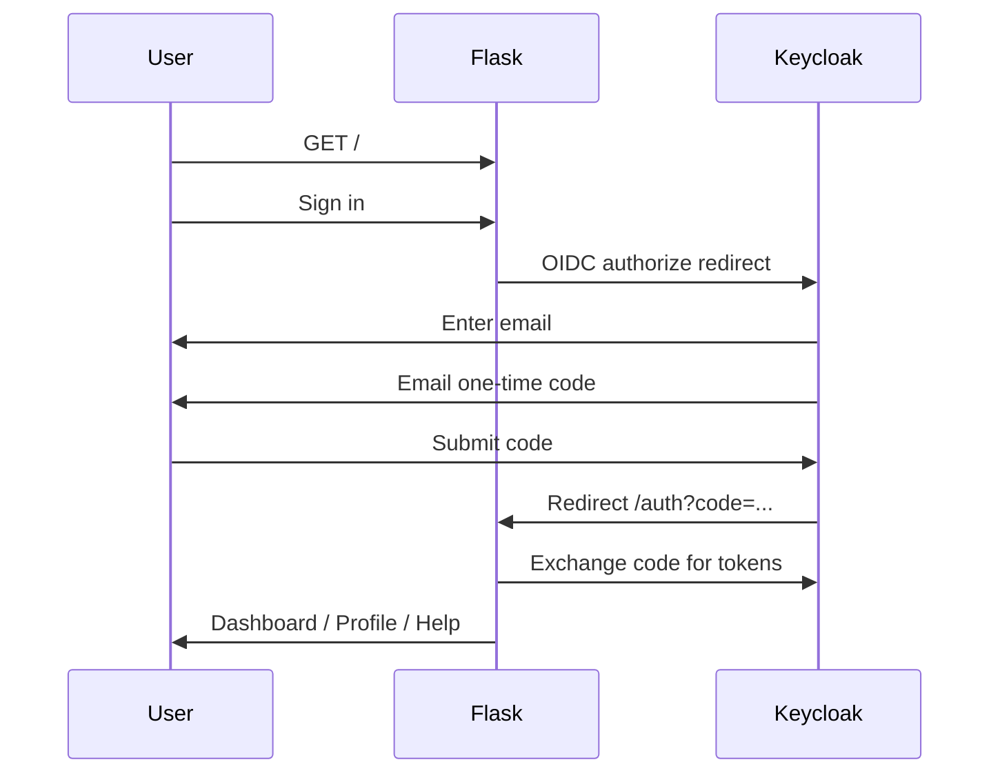

# Keycloak passwordless login (email one-time code)

Users live in Keycloak. The Flask app only handles **post-login** pages (Dashboard, Profile, Help).  
Sign-in and the **Email One-time Code** screen are handled by Keycloak.

Keycloak does **not** ship email OTP out of the box. Use an authenticator SPI such as:

- [for-keycloak/email-otp-authenticator](https://github.com/for-keycloak/email-otp-authenticator)

## 1. Install the email OTP provider

Build or download the JAR for your Keycloak version and add it to your deployment, then restart Keycloak.

For OpenShift, mount the JAR into `/opt/keycloak/providers/` and rebuild the image if required.

## 2. Configure realm email (SMTP)

1. **Realm settings → Email**
2. Set SMTP host, port, from address, and authentication
3. Send a test email

Without SMTP, codes cannot be sent.

## 3. Create users

1. **Users → Add user**
2. Set **Email** and **Email verified** = On
3. Set **Username** = email (recommended if `login with email` is enabled)

## 4. Authentication flow (passwordless)

1. **Authentication → Flows**
2. Copy the **browser** flow to e.g. `browser-passwordless`
3. Remove **Password** / **Username Password Form** executions
4. Add executions (order matters), for example:
   - `auth-cookie` (ALTERNATIVE)
   - `identity-provider-redirector` (ALTERNATIVE)
   - Subflow or steps from the email OTP plugin docs (typically email capture + email OTP)
5. **Authentication → Bindings**
   - **Browser flow** = `browser-passwordless`

Follow the SPI README for exact execution names (e.g. `email-otp-authenticator`).

## 5. Realm login settings

**Realm settings → Login**

- **Login with email** = On
- **Duplicate emails** = Off (recommended)
- **Password** optional – users do not need a password when using email OTP only

## 6. OIDC client for the Flask app

Client ID must match `CLIENT_ID` in the deployment (e.g. `python-app`).

| Setting | Value |
|---------|--------|
| Client authentication | On (confidential) |
| Standard flow | On |
| Valid redirect URIs | `https://<python-app-route>/auth` |
| Valid post logout redirect URIs | `https://<python-app-route>/` |
| Web origins | `https://<python-app-route>` |

## 7. Theme the login / OTP screens (optional)

To match GOV.UK Internal Access on the **Email One-time Code** page, use your `govuk-internal` theme:

1. **Realm settings → Themes**
2. **Login theme** = `govuk-internal` (or a child theme)
3. Customize FreeMarker templates under `login/` for the OTP authenticator’s form templates (see SPI docs)

The Flask app does not render the OTP page; it only receives tokens after Keycloak completes authentication.

## 8. Flask environment variables

```bash
CLIENT_ID=python-app
CLIENT_SECRET=<from Keycloak client>
OIDC_ISSUER=https://keycloak-keycloak.apps-crc.testing/realms/python-app
SECRET_KEY=<long random string>

# Optional – profile display name updates
KEYCLOAK_ADMIN_CLIENT_ID=admin-cli-service
KEYCLOAK_ADMIN_CLIENT_SECRET=<secret>
KEYCLOAK_ADMIN_REALM=master
```

## 9. End-to-end flow



## 10. Profile display name in tokens (optional)

To show an updated display name without Admin API, add a **User Attribute** mapper to the client:

- Attribute name: `displayName`
- Token claim name: `displayName`
- Add to ID token and userinfo

Then map `displayName` in Flask from `userinfo` (already supported in `app.py`).
